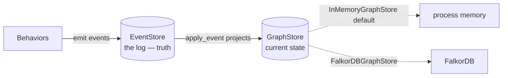

# Using the FalkorDB graph store

By default, Active Graph keeps the **materialized graph** — objects,
relations, and patches — in process memory. That projection is rebuilt
from the event log on every run, so it never needs to be durable. But
memory is not the only place it can live. `FalkorDBGraphStore` pushes the
projection into a [FalkorDB](https://www.falkordb.com/) graph so you can
query the current-state view with Cypher, share it across processes, or
keep a large graph out of your heap.

This guide is about the **graph store**, not the **event store**. They are
different seams and it is worth being precise about which is which.

---

## Two stores, two jobs

Active Graph has two distinct storage seams. Confusing them is the most
common mistake when wiring up FalkorDB.

| | `EventStore` | `GraphStore` |
|---|---|---|
| Holds | The append-only **event log** | The materialized **current-state** projection |
| Role | Source of truth — durable, replayable | A cache/view rebuilt by replaying the log |
| Default | `SQLiteEventStore` | `InMemoryGraphStore` |
| FalkorDB? | No | `FalkorDBGraphStore` |

The event log is truth. The graph store is a projection of that truth.
`FalkorDBGraphStore` is a `GraphStore` — it does **not** make your run
durable, and it is **not** a replacement for SQLite or Postgres. If the
FalkorDB graph is wiped, replaying the event log rebuilds it. For
durability and audit, keep using an `EventStore`; FalkorDB is purely about
*where the current-state view lives and how you query it*.



---

## Install

The store has two backends, each behind its own extra:

```bash
# Server mode: connect to a running FalkorDB (recommended).
pip install 'activegraph[falkordb]'

# Embedded mode: zero-infrastructure, self-managed engine.
pip install 'activegraph[falkordb-embedded]'
```

Pick **server mode** for anything beyond a quick local experiment. The
embedded engine (`falkordblite`) bundles its own Redis + FalkorDB module
and needs Python 3.12+, which makes it convenient for demos but heavier and
less portable than pointing at a server you already run.

---

## Run a FalkorDB server

The fastest way to get a server is Docker:

```bash
docker run -d --rm -p 6379:6379 falkordb/falkordb:latest
```

That exposes FalkorDB on `localhost:6379`. FalkorDB also ships a browser UI
on port `3000` if you run the `falkordb/falkordb-bundle` image.

---

## Connect

`FalkorDBGraphStore` resolves its backend in a fixed priority order. The
first matching source wins:

1. **An explicit graph handle** — `graph=` (anything exposing
   `query` / `ro_query`). You own its lifecycle.
2. **Explicit server settings** — `url=` or
   `host=`/`port=`/`username=`/`password=`.
3. **Environment variables** — `FALKORDB_URL`, or `FALKORDB_HOST` (with
   optional `FALKORDB_PORT` / `FALKORDB_USERNAME` / `FALKORDB_PASSWORD`).
4. **Embedded fallback** — `falkordblite`, when nothing above is set.

### With explicit arguments

```python
from activegraph import FalkorDBGraphStore

# Host/port form.
store = FalkorDBGraphStore(host="localhost", port=6379)

# URL form.
store = FalkorDBGraphStore(url="falkor://localhost:6379")

# With auth.
store = FalkorDBGraphStore(
    host="falkordb.internal",
    port=6379,
    username="app",
    password="…",
)
```

### With environment variables

This is the deployment-friendly path: leave connection details out of your
code and supply them from the environment.

```bash
export FALKORDB_HOST=localhost
export FALKORDB_PORT=6379
# Optional:
# export FALKORDB_USERNAME=app
# export FALKORDB_PASSWORD=…
# Or, instead of host/port, a single URL:
# export FALKORDB_URL=falkor://localhost:6379
```

```python
from activegraph import FalkorDBGraphStore

# No connection args — picks up FALKORDB_* from the environment.
store = FalkorDBGraphStore()
```

Explicit arguments always override the environment, so you can set defaults
via env vars and selectively override them in code.

### Embedded mode

Pass nothing connection-related (and have no `FALKORDB_*` env vars set) to
get the self-managed engine. An optional `path` gives the embedded database
a file to persist to; omit it for an ephemeral instance.

```python
from activegraph import FalkorDBGraphStore

store = FalkorDBGraphStore()                 # ephemeral embedded
store = FalkorDBGraphStore(path="graph.db")  # persisted embedded
```

---

## Wire it into a graph

The graph store is injected at `Graph` construction. Everything else — the
behaviors, the runtime, the event log — is unchanged.

```python
from activegraph import Graph, FalkorDBGraphStore

store = FalkorDBGraphStore(host="localhost", port=6379)
graph = Graph(graph_store=store)

# Use the graph exactly as you would with the in-memory store.
alice = graph.add_object("person", {"name": "Alice"})
bob = graph.add_object("person", {"name": "Bob"})
graph.add_relation(alice.id, bob.id, "knows")

print([o.data["name"] for o in graph.all_objects()])
# -> ['Alice', 'Bob']
```

`Graph` is the only place the seam is exposed. Reads (`get_object`,
`all_relations`, neighborhood walks) and the `apply_event` projector route
through the store transparently, so behaviors need no changes.

### Naming graphs

Multiple runs can share one FalkorDB server by giving each its own named
graph:

```python
store = FalkorDBGraphStore(host="localhost", graph_name=f"run-{run_id}")
```

`graph_name` defaults to `"activegraph"`. Use a distinct name per run (or
per tenant) to keep their projections isolated on a shared server.

### Replaying an existing run into FalkorDB

`Runtime.load` accepts the same `graph_store` parameter, so you can take a
run that was recorded with the default in-memory store and rebuild its
current-state projection in FalkorDB by replaying the event log:

```python
from activegraph import Runtime, FalkorDBGraphStore

store = FalkorDBGraphStore(host="localhost", graph_name="run-42")
rt = Runtime.load("runs.db", run_id="run-42", graph_store=store)

# The log has been replayed into FalkorDB; query it with Cypher.
```

The event log in `runs.db` stays the source of truth; `graph_store` only
chooses where the replayed projection is materialized.

`Runtime.fork(..., graph_store=...)` accepts the same parameter, so a fork's
current-state projection can be built in its own FalkorDB graph too.

---

## How entities are stored


Objects and relations form a **real graph** — relations are native edges,
so you can inspect and traverse the projection directly with Cypher and in
the FalkorDB Browser:

| Entity | Shape |
|---|---|
| Object | `(:AGNode:AGObject {id, type, version, data, provenance})` |
| Relation | `(s:AGNode)-[:AGRelation {id, type, data, provenance}]->(t:AGNode)` |
| Patch | `(:AGPatch {id, doc})` |

A few deliberate choices:

- **Relations are native edges.** Every relation is an `AGRelation` edge
  between two `AGNode` endpoints, so neighborhood walks and visualization
  work natively. The relation's own kind (`links`, `cites`, …) is carried
  as the edge's `type` *property* rather than the relationship type — the
  relationship type is always the fixed literal `AGRelation`. That keeps
  every value a bound `$param` (nothing user-supplied is ever interpolated
  into Cypher), at the cost of filtering by `r.type` instead of by
  relationship label.
- **Dangling relations are supported via placeholders.** The in-memory
  store allows a relation to reference objects that do not exist yet. Here,
  `put_relation` creates each missing endpoint as a bare `:AGNode`
  **placeholder** (an `:AGNode` *without* the `:AGObject` label). When the
  object is later added, the same node is promoted in place; when a
  relation is removed, any endpoint left as an orphaned placeholder is
  garbage-collected. Placeholder-ness is derived (`:AGNode AND NOT
  :AGObject`), never a stored flag.
- **`source` / `target` are not stored.** They fall out of the edge's
  endpoints, so the graph is the single source of truth for connectivity.
- **`data` / `provenance` are JSON-encoded strings.** FalkorDB properties
  are scalars, so structured payloads are serialized. The store decodes
  them back into rich objects on read.
- **Cascade-on-removal lives in the projector, not the database.** Removing
  an object deletes its relations via `apply_event` in `core.graph`, so the
  behavior is identical across every `GraphStore`.
- **Structural `Graph` queries push down to Cypher.** Type filters
  (`graph.objects(type=...)`, `graph.objects_in_types(...)`), relation lookups
  (`graph.relations(...)`, `graph.get_relations(...)`), neighborhood walks
  (`graph.neighborhood(...)`), and whole pattern chains
  (`graph.match_chain(...)`, the engine behind behavior pattern matching)
  are translated into Cypher and evaluated
  inside FalkorDB, so they fetch only the matching rows instead of scanning
  the whole projection. A multi-hop pattern collapses into a single
  index-backed query rather than one round-trip per hop. Relation-behavior
  matching and type-scoped behavior views (`include_types`) ride the same
  hooks. The default
  `GraphStore` implementations compute the
  same results in Python, so query semantics stay identical across every
  backend.
- **`where` predicates still run in Python.** `graph.objects(where=...)`
  pushes the *type* filter down but applies the `where` clause in Python
  over the returned objects, because the structured `data` payload is stored
  as a JSON string rather than as native, indexable properties. Likewise a
  pattern's node `{prop: value}` equality and `WHERE` clause are applied in
  Python over the chains `match_chain` returns. Other whole-graph consumers
  (diffing, prompt building, fork comparison, CLI
  status) still read the full projection via `all_objects()` /
  `all_relations()`. FalkorDB remains best for small-to-medium live
  projections and Cypher-side inspection.

Every value crosses the Cypher boundary as a bound `$param`, never via
string interpolation — object ids, types, and payloads cannot inject
Cypher.

To poke at a run's projection by hand:
 
```cypher
// All objects of a given type.
MATCH (o:AGObject {type: 'person'}) RETURN o.id, o.data

// A node and what it points at, via the native edge.
MATCH (s:AGNode {id: $id})-[r:AGRelation]->(t:AGNode)
RETURN t.id, r.type

// Filter relations by kind (the kind is an edge property).
MATCH (s)-[r:AGRelation {type: 'cites'}]->(t) RETURN s.id, t.id
```

---

## Performance: where the seam pays off

The two backends optimize for opposite things, and the trade-off only
becomes visible as the graph grows. `InMemoryGraphStore` is heap-resident
Python dicts: every read is a pointer chase with no serialization and no
network hop. `FalkorDBGraphStore` pays a fixed round-trip-plus-JSON cost on
every call, but the **pushed-down** reads run as index-backed Cypher inside
the database, so their cost tracks the size of the **result**, not the size
of the whole projection.

The numbers below come from
[`scripts/benchmark_falkordb.py`](https://github.com/yoheinakajima/activegraph/blob/main/scripts/benchmark_falkordb.py),
which builds the same chained graph on both backends and times each path
(best-of-5 for queries) at three sizes. They are **indicative and
hardware-dependent** — a local FalkorDB container over loopback, one
machine. Read the *ratios between rows*, not the absolute milliseconds.

| Operation | Size (objects) | InMemory (ms) | FalkorDB (ms) |
|---|---|---|---|
| build (write) | small (200) | 2.96 | 231 |
| full scan (`all_objects`) | small (200) | <0.01 | 1.91 |
| type-scoped read | small (200) | <0.01 | 0.67 |
| neighborhood depth=2 | small (200) | 0.01 | 1.05 |
| 2-hop pattern match | small (200) | 0.87 | 3.03 |
| cascade delete | small (200) | 0.02 | 3.14 |
| build (write) | medium (2,000) | 30.8 | 2,067 |
| full scan (`all_objects`) | medium (2,000) | 0.01 | 18.9 |
| type-scoped read | medium (2,000) | 0.04 | 4.69 |
| neighborhood depth=2 | medium (2,000) | 0.11 | 0.85 |
| 2-hop pattern match | medium (2,000) | 80.4 | 27.1 |
| cascade delete | medium (2,000) | 0.10 | 5.88 |
| build (write) | large (20,000) | 273 | 26,595 |
| full scan (`all_objects`) | large (20,000) | 0.05 | 97.3 |
| type-scoped read | large (20,000) | 0.31 | 50.0 |
| neighborhood depth=2 | large (20,000) | 1.07 | 0.94 |
| 2-hop pattern match | large (20,000) | 8,920 | 300 |
| cascade delete | large (20,000) | 0.98 | 40.3 |

What the table is telling you:

- **In-memory wins raw latency on small and medium graphs, and always wins
  on writes.** With no serialization and no network, dict operations are
  sub-millisecond. Every FalkorDB write is a round-trip, so building a large
  projection edge-by-edge is the backend's worst case (the ~27 s build is
  one-time setup cost, not query cost). If your projection fits comfortably
  in memory and is short-lived, `InMemoryGraphStore` is simply faster.
- **The pushed-down structural reads flip the comparison as the graph
  grows.** A 2-hop pattern match over 20,000 objects collapses into a single
  index-backed Cypher query (~300 ms) instead of the matcher's
  whole-projection walk (~8.9 s) — roughly **30× faster**, and the gap widens
  with size because FalkorDB's cost scales with matches, not nodes.
  `neighborhood` is already on par at the large size (0.94 ms vs 1.07 ms)
  for the same reason.
- **The un-pushable paths stay proportional to graph size on both
  backends.** A full `all_objects()` scan, and the Python-side consumers
  that depend on it (diffing, prompt building, `where` predicates), pull the
  whole projection across the wire and JSON-decode it, so FalkorDB is slower
  there — that's the cost of keeping a large graph off the heap.

The rule of thumb: reach for FalkorDB when the graph is **large and
long-lived** and your hot path is **structural queries** (type filters,
neighborhoods, pattern-driven behaviors) — exactly the paths that push down.
Stay in memory when the projection is small, write-heavy, or disposable.

!!! note "This is a latency win, not a token win"
    These optimizations change *how the projection is queried*, not *what
    the LLM sees*. Both backends produce a byte-for-byte identical `View`
    for the same `view_spec`, so the serialized prompt — and its token
    count — is the same either way. LLM token usage is bounded by **view
    scoping** (`include_types`, `around` + `depth`), which decides what
    lands in the prompt. The push-down just makes producing that scoped
    slice cheap on a large graph, instead of pulling the whole projection
    into Python to trim it down.

---

## Lifecycle and cleanup

When the store opened its own connection (server or embedded), `close()`
releases it:

```python
store = FalkorDBGraphStore(host="localhost")
try:
    graph = Graph(graph_store=store)
    ...
finally:
    store.close()
```

If you passed your own `graph=` handle, the store does **not** close it —
you own that lifecycle. `clear()` detaches and wipes only this graph's
`AGNode` (objects + placeholders, with their `AGRelation` edges) and
`AGPatch` nodes, leaving anything else in the FalkorDB graph untouched.

---

## Why there's no CLI flag for it

`FalkorDBGraphStore` is a **library-level** choice — you wire it in with
`Graph(graph_store=...)`. The `activegraph` CLI deliberately does **not**
expose a `--graph-store` option, and that is by design, not an omission.

The reason is the two-seam split this guide opened with. The CLI's storage
flags select an **`EventStore`** (the durable log) because every CLI
command — `inspect`, `replay`, `fork`, `diff` — reads *the log*. The log is
the artifact operators carry around, so choosing where it lives belongs on
the operator surface.

A `GraphStore` is the opposite kind of thing: a **disposable projection**,
rebuilt from the log on every run. Routing the CLI's read-only commands
through FalkorDB would mean standing up an external database only to
materialize a projection that's discarded when the command exits — adding
required infrastructure to commands that are designed to need none.

It also wouldn't buy you anything. FalkorDB's value — querying current
state with Cypher, sharing the projection across processes, keeping a large
graph off the heap — only applies to a **live, long-running run**. The CLI
doesn't drive those; it inspects an existing event log. Live runs happen in
a Python entry point, which is exactly where `Graph(graph_store=...)` lives.
So FalkorDB is used where it pays off, and the CLI stays infrastructure-light.

---

## When to reach for it

Use `FalkorDBGraphStore` when you want to:

- **Query current state with Cypher** — dashboards or ad-hoc queries over
  the live projection. Relations are native `AGRelation` edges between
  `AGNode` endpoints, so neighborhood walks and edge-traversal queries work
  natively; filter a relation's kind on its `type` *property*.
- **Share the projection across processes** — one writer plus several
  read-only inspectors hitting the same FalkorDB graph.
- **Keep a large graph off the heap** — projections that don't fit
  comfortably in process memory.

Stick with the default `InMemoryGraphStore` when none of that applies. It
is faster, has zero dependencies, and is rebuilt from the event log just
the same. Remember: whichever store you choose, **durability and audit come
from the `EventStore`, not from here** — see
[Operating in production](operating-in-production.md) for the persistence
and replay story.
