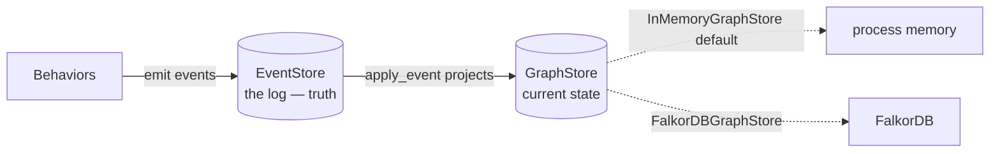

# Using the FalkorDB graph store

By default, Active Graph keeps the **materialized graph** — objects,
relations, and patches — in process memory. That projection is rebuilt
from the event log on every run, so it never needs to be durable. But
memory is not the only place it can live. `FalkorDBGraphStore` pushes the
projection into a [FalkorDB](https://www.falkordb.com/) graph so you can
query the current-state view with Cypher, share it across processes, or
keep a large graph out of your heap.

This guide is about the **graph store**, not the **event store**. They are
different seams and it is worth being precise about which is which.

---

## Two stores, two jobs

Active Graph has two distinct storage seams. Confusing them is the most
common mistake when wiring up FalkorDB.

| | `EventStore` | `GraphStore` |
|---|---|---|
| Holds | The append-only **event log** | The materialized **current-state** projection |
| Role | Source of truth — durable, replayable | A cache/view rebuilt by replaying the log |
| Default | `SQLiteEventStore` | `InMemoryGraphStore` |
| FalkorDB? | No | `FalkorDBGraphStore` |

The event log is truth. The graph store is a projection of that truth.
`FalkorDBGraphStore` is a `GraphStore` — it does **not** make your run
durable, and it is **not** a replacement for SQLite or Postgres. If the
FalkorDB graph is wiped, replaying the event log rebuilds it. For
durability and audit, keep using an `EventStore`; FalkorDB is purely about
*where the current-state view lives and how you query it*.



---

## Install

The store has two backends, each behind its own extra:

```bash
# Server mode: connect to a running FalkorDB (recommended).
pip install 'activegraph[falkordb]'

# Embedded mode: zero-infrastructure, self-managed engine.
pip install 'activegraph[falkordb-embedded]'
```

Pick **server mode** for anything beyond a quick local experiment. The
embedded engine (`falkordblite`) bundles its own Redis + FalkorDB module
and needs Python 3.12+, which makes it convenient for demos but heavier and
less portable than pointing at a server you already run.

---

## Run a FalkorDB server

The fastest way to get a server is Docker:

```bash
docker run -d --rm -p 6379:6379 falkordb/falkordb:latest
```

That exposes FalkorDB on `localhost:6379`. FalkorDB also ships a browser UI
on port `3000` if you run the `falkordb/falkordb-bundle` image.

---

## Connect

`FalkorDBGraphStore` resolves its backend in a fixed priority order. The
first matching source wins:

1. **An explicit graph handle** — `graph=` (anything exposing
   `query` / `ro_query`). You own its lifecycle.
2. **Explicit server settings** — `url=` or
   `host=`/`port=`/`username=`/`password=`.
3. **Environment variables** — `FALKORDB_URL`, or `FALKORDB_HOST` (with
   optional `FALKORDB_PORT` / `FALKORDB_USERNAME` / `FALKORDB_PASSWORD`).
4. **Embedded fallback** — `falkordblite`, when nothing above is set.

### With explicit arguments

```python
from activegraph import FalkorDBGraphStore

# Host/port form.
store = FalkorDBGraphStore(host="localhost", port=6379)

# URL form.
store = FalkorDBGraphStore(url="falkor://localhost:6379")

# With auth.
store = FalkorDBGraphStore(
    host="falkordb.internal",
    port=6379,
    username="app",
    password="…",
)
```

### With environment variables

This is the deployment-friendly path: leave connection details out of your
code and supply them from the environment.

```bash
export FALKORDB_HOST=localhost
export FALKORDB_PORT=6379
# Optional:
# export FALKORDB_USERNAME=app
# export FALKORDB_PASSWORD=…
# Or, instead of host/port, a single URL:
# export FALKORDB_URL=falkor://localhost:6379
```

```python
from activegraph import FalkorDBGraphStore

# No connection args — picks up FALKORDB_* from the environment.
store = FalkorDBGraphStore()
```

Explicit arguments always override the environment, so you can set defaults
via env vars and selectively override them in code.

### Embedded mode

Pass nothing connection-related (and have no `FALKORDB_*` env vars set) to
get the self-managed engine. An optional `path` gives the embedded database
a file to persist to; omit it for an ephemeral instance.

```python
from activegraph import FalkorDBGraphStore

store = FalkorDBGraphStore()                 # ephemeral embedded
store = FalkorDBGraphStore(path="graph.db")  # persisted embedded
```

---

## Wire it into a graph

The graph store is injected at `Graph` construction. Everything else — the
behaviors, the runtime, the event log — is unchanged.

```python
from activegraph import Graph, FalkorDBGraphStore

store = FalkorDBGraphStore(host="localhost", port=6379)
graph = Graph(graph_store=store)

# Use the graph exactly as you would with the in-memory store.
alice = graph.add_object("person", {"name": "Alice"})
bob = graph.add_object("person", {"name": "Bob"})
graph.add_relation(alice.id, bob.id, "knows")

print([o.data["name"] for o in graph.all_objects()])
# -> ['Alice', 'Bob']
```

`Graph` is the only place the seam is exposed. Reads (`get_object`,
`all_relations`, neighborhood walks) and the `apply_event` projector route
through the store transparently, so behaviors need no changes.

### Naming graphs

Multiple runs can share one FalkorDB server by giving each its own named
graph:

```python
store = FalkorDBGraphStore(host="localhost", graph_name=f"run-{run_id}")
```

`graph_name` defaults to `"activegraph"`. Use a distinct name per run (or
per tenant) to keep their projections isolated on a shared server.

### Replaying an existing run into FalkorDB

`Runtime.load` accepts the same `graph_store` parameter, so you can take a
run that was recorded with the default in-memory store and rebuild its
current-state projection in FalkorDB by replaying the event log:

```python
from activegraph import Runtime, FalkorDBGraphStore

store = FalkorDBGraphStore(host="localhost", graph_name="run-42")
rt = Runtime.load("runs.db", run_id="run-42", graph_store=store)

# The log has been replayed into FalkorDB; query it with Cypher.
```

The event log in `runs.db` stays the source of truth; `graph_store` only
chooses where the replayed projection is materialized.

`Runtime.fork(..., graph_store=...)` accepts the same parameter, so a fork's
current-state projection can be built in its own FalkorDB graph too.

---

## How entities are stored


Each entity kind is a labelled node keyed by `id`, which means you can
inspect and query the projection directly with Cypher:

| Entity | Node |
|---|---|
| Object | `(:AGObject {id, type, version, data, provenance})` |
| Relation | `(:AGRelation {id, source, target, type, data, provenance})` |
| Patch | `(:AGPatch {id, doc})` |

A few deliberate choices:

- **`data` / `provenance` are JSON-encoded strings.** FalkorDB node
  properties are scalars, so structured payloads are serialized. The store
  decodes them back into rich objects on read.
- **Relations are nodes, not native edges.** The in-memory store allows a
  relation to reference objects that do not exist yet (a dangling
  relation). Native edges cannot dangle, so relations are modeled as nodes
  to match those semantics exactly.
- **Cascade-on-removal lives in the projector, not the database.** Removing
  an object deletes its relations via `apply_event` in `core.graph`, so the
  behavior is identical across every `GraphStore`.
- **`Graph` queries read the whole projection.** Filters, neighborhood
  walks, and `where` evaluation run in Python over `all_objects()` /
  `all_relations()`, so each call fetches and decodes every node from
  FalkorDB rather than pushing the query down as Cypher. This keeps query
  semantics identical across every backend, but means FalkorDB is best for
  small-to-medium live projections and Cypher-side inspection — not for
  pushing large traversals into the database.

Every value crosses the Cypher boundary as a bound `$param`, never via
string interpolation — object ids, types, and payloads cannot inject
Cypher.

To poke at a run's projection by hand:

```cypher
// All objects of a given type.
MATCH (o:AGObject {type: 'person'}) RETURN o.id, o.data

// A node and what it points at.
MATCH (r:AGRelation {source: $id}) RETURN r.target, r.type
```

---

## Lifecycle and cleanup

When the store opened its own connection (server or embedded), `close()`
releases it:

```python
store = FalkorDBGraphStore(host="localhost")
try:
    graph = Graph(graph_store=store)
    ...
finally:
    store.close()
```

If you passed your own `graph=` handle, the store does **not** close it —
you own that lifecycle. `clear()` wipes only this graph's
`AGObject`/`AGRelation`/`AGPatch` nodes, leaving anything else in the
FalkorDB graph untouched.

---

## Why there's no CLI flag for it

`FalkorDBGraphStore` is a **library-level** choice — you wire it in with
`Graph(graph_store=...)`. The `activegraph` CLI deliberately does **not**
expose a `--graph-store` option, and that is by design, not an omission.

The reason is the two-seam split this guide opened with. The CLI's storage
flags select an **`EventStore`** (the durable log) because every CLI
command — `inspect`, `replay`, `fork`, `diff` — reads *the log*. The log is
the artifact operators carry around, so choosing where it lives belongs on
the operator surface.

A `GraphStore` is the opposite kind of thing: a **disposable projection**,
rebuilt from the log on every run. Routing the CLI's read-only commands
through FalkorDB would mean standing up an external database only to
materialize a projection that's discarded when the command exits — adding
required infrastructure to commands that are designed to need none.

It also wouldn't buy you anything. FalkorDB's value — querying current
state with Cypher, sharing the projection across processes, keeping a large
graph off the heap — only applies to a **live, long-running run**. The CLI
doesn't drive those; it inspects an existing event log. Live runs happen in
a Python entry point, which is exactly where `Graph(graph_store=...)` lives.
So FalkorDB is used where it pays off, and the CLI stays infrastructure-light.

---

## When to reach for it

Use `FalkorDBGraphStore` when you want to:

- **Query current state with Cypher** — dashboards or ad-hoc queries over
  the live projection. Match `AGRelation` nodes by their `source` / `target`
  properties; relations are nodes, not native edges, so native
  edge-traversal algorithms don't apply directly.
- **Share the projection across processes** — one writer plus several
  read-only inspectors hitting the same FalkorDB graph.
- **Keep a large graph off the heap** — projections that don't fit
  comfortably in process memory.

Stick with the default `InMemoryGraphStore` when none of that applies. It
is faster, has zero dependencies, and is rebuilt from the event log just
the same. Remember: whichever store you choose, **durability and audit come
from the `EventStore`, not from here** — see
[Operating in production](operating-in-production.md) for the persistence
and replay story.
